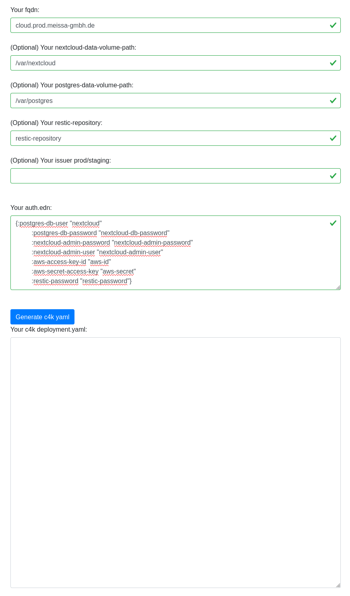

# convention 4 kubernetes: c4k-nextcloud
[](https://clojars.org/org.domaindrivenarchitecture/c4k-nextcloud) [](https://gitlab.com/domaindrivenarchitecture/c4k-nextcloud/-/commits/master) 

[ chat over e-mail](mailto:buero@meissa-gmbh.de?subject=community-chat) | [ team@social.meissa-gmbh.de](https://social.meissa-gmbh.de/@team) | [Website & Blog](https://domaindrivenarchitecture.org)

## Purpose

c4k-nextcloud provides a k8s deployment for nextcloud containing:
* adjusted nextcloud docker image
* nextcloud
* ingress having a letsencrypt managed certificate
* postgres database

The package aims to a low load sceanrio.

## Status

Stable - we use this setup on production.

## Try out

Click on the image to try out live in your browser:

[](https://domaindrivenarchitecture.org/pages/dda-provision/c4k-nextcloud/)

Your input will stay in your browser. No server interaction is required.

You will also be able to try out on cli:
```
target/graalvm/c4k-nextcloud src/test/resources/valid-config.edn src/test/resources/valid-auth.edn | kubeval -
target/graalvm/c4k-nextcloud src/test/resources/valid-config.edn src/test/resources/valid-auth.edn | kubectl apply -f -
```

## Documentation
* [Example Setup on Hetzner](doc/SetupOnHetzner.md)
* Backup and Restore

## Development & mirrors

Development happens at: https://repo.prod.meissa.de/meissa/c4k-nextcloud

Mirrors are:

* https://codeberg.org/meissa/c4k-nextcloud (Issues and PR)
* https://gitlab.com/domaindrivenarchitecture/c4k-nextcloud (CI)
* https://github.com/DomainDrivenArchitecture/c4k-nextcloud

For more details about our repository model see: https://repo.prod.meissa.de/meissa/federate-your-repos


## License

Copyright © 2021, 2022, 2023, 2024 meissa GmbH
Licensed under the [Apache License, Version 2.0](LICENSE) (the "License")
Pls. find licenses of our subcomponents [here](doc/SUBCOMPONENT_LICENSE)
